<div align="center">


# Tandem

**Reliable, strictly-ordered event delivery from your database to Apache Kafka — no CDC, no Kafka Connect, no two-phase commit.**

[](https://github.com/alirux/tandem/actions/workflows/ci.yml)
[](https://codecov.io/github/alirux/tandem)
[](LICENSE)
[](#)
[](https://central.sonatype.com/artifact/com.codingful/tandem-core)
[](https://github.com/alirux/tandem/releases)

**[tandem.codingful.com](https://tandem.codingful.com)**

</div>

## What is Tandem?

Tandem is a Java library that implements the **Transactional Outbox Pattern**. You insert an
event into an `outbox` table **inside the same transaction** that mutates your domain — so the
write is atomic by your database's ACID guarantees, with no dual-write and no distributed
transaction. A separate **relay** then polls the outbox and publishes to Kafka, at-least-once,
preserving per-aggregate ordering.



*A live, interactive version of this same flow — pause, step back/forward through each stage — is
available at [tandem.codingful.com/how-it-works](https://tandem.codingful.com/how-it-works/).*


It targets the gap between a **hand-rolled outbox** (correct, but every subtle trap is yours to
get right) and **Debezium/CDC** (powerful, but a separate distributed system to operate):
no extra infrastructure — just your relational database and Kafka — with the correctness traps
already handled.

## Why Tandem?

The classic **double write** — write to the DB, then publish to Kafka as two non-atomic steps —
diverges permanently on partial failure. Tandem removes the dual-write:

```
BEGIN TX
  UPDATE aggregate SET status = ? WHERE id = ?
  INSERT INTO tandem_outbox (aggregate_id, type, payload, ...)
COMMIT TX                  ← both or neither, guaranteed by the DB
```

If the relay crashes after publishing but before marking the row done, it republishes — a
**duplicate** (manageable, provided consumers are idempotent), never a **divergence**.

## Try it

`tandem-sample` is a self-contained tutorial you can run immediately — no Maven Central required.
It starts real PostgreSQL and Kafka containers via Testcontainers, inserts 5 outbox events for two
interleaved orders, and verifies that the relay delivers them in per-aggregate sequence order.

Two of the things you end up looking at — both reproduced by a command below, neither a mockup:

<p align="center"></p>

<p align="center"><em><code>tandem-cli outbox summary --watch</code> — the outbox, redrawing in place.</em></p>

<p align="center"></p>

<p align="center"><em><code>metricsDashboardDemo</code> — the relay's own signals on a live Grafana, during a failing aggregate.</em></p>

**Prerequisites:** Java 17+, Docker (Docker Desktop or Colima).

```bash
# macOS / Linux
git clone https://github.com/alirux/tandem.git
cd tandem
./tandem-sample/run.sh
```

```cmd
:: Windows
git clone https://github.com/alirux/tandem.git
cd tandem
tandem-sample\run.cmd
```

The script prints JDBC and Kafka connection details so you can connect external clients while the
demo is running. Containers stay alive until you press ENTER.

For the **Spring Boot** write-side experience, run the Spring sample instead — it boots a Spring
application against a Testcontainers PostgreSQL, writes events through the `@TransactionalOutbox`,
Template and Spring-events tiers, and delivers them to Kafka in per-aggregate order:

```bash
# macOS / Linux
./tandem-sample-spring/run.sh
```

```cmd
:: Windows
tandem-sample-spring\run.cmd
```

The Spring sample also demonstrates the Admin API (`tandem.admin.enabled: true` in its
`application.yml`) against the same outbox it just wrote to — reads, and replay/discard on a row
the demo deliberately manufactures as `FAILED` for this purpose. Once the demo narration finishes,
the app keeps running as a web server (Ctrl+C to stop) and prints the exact commands to try,
including the real id of that row:

```bash
curl http://localhost:8080/tandem/admin/v1/outbox/summary
curl http://localhost:8080/tandem/admin/v1/outbox/messages
curl http://localhost:8080/tandem/admin/v1/outbox/messages/1

# Replace 1 with the id the demo printed
curl -X POST http://localhost:8080/tandem/admin/v1/outbox/messages/1/replay
curl -X POST http://localhost:8080/tandem/admin/v1/outbox/messages/1/discard \
     -H 'Content-Type: application/json' \
     -d '{"acknowledgeOrderingBreak": true, "reason": "demo"}'

# Relay control - works under this SINGLE coordination, the default:
curl http://localhost:8080/tandem/admin/v1/relay/status
curl -X POST http://localhost:8080/tandem/admin/v1/relay/pause
curl -X POST http://localhost:8080/tandem/admin/v1/relay/resume
```

`GET /relay/buckets`, `GET /relay/buckets/{bucket}`, `GET /relay/workers`, and
`POST /relay/buckets/{bucket}/release` need `LEASE` coordination — `SINGLE` refuses them (`409`)
rather than answer with misleading data. Run the sample under `LEASE` instead to try those for real,
against an actually-owned bucket:

```bash
./tandem-sample-spring/run-lease.sh
```

Prefer a CLI over hand-built `curl` calls? [`tandem-cli`](tandem-cli/) wraps the same Admin API
endpoints in discoverable verbs and typed flags. Build it from source and point it at the sample
(`--base-url` takes the same `.../tandem/admin/v1` prefix the `curl` commands above use):

```bash
cd tandem-cli && make build && cd ..
./tandem-cli/bin/tandem-cli --base-url http://localhost:8080/tandem/admin/v1 outbox summary
./tandem-cli/bin/tandem-cli --base-url http://localhost:8080/tandem/admin/v1 relay status
```

Add `--watch` to `outbox summary` for the live, redrawing-in-place dashboard shown at the top of
this section — bar charts for `PENDING`/`IN_FLIGHT`/`FAILED`, refreshed on an interval, colored so
a growing red `FAILED` bar catches the eye without reading the number.

See [tandem-cli/docs/cli](tandem-cli/docs/cli/tandem-cli.md) for the full command reference.

To see the relay's own metrics rather than take them on faith, `tandem-benchmark`'s
`metricsDashboardDemo` runs a real Micrometer → Prometheus → Grafana pipeline through nine
scripted phases — no relay running, a drain, steady load, a failing aggregate, two unserialised
writers to one aggregate, a second instance joining, that instance's worker getting stuck without
crashing, a crash with rows in flight, recovery — and holds the dashboard open so every signal
`TandemMetrics` reports can be read on a live graph instead of asserted in a test:

```bash
./gradlew :tandem-benchmark:metricsDashboardDemo
```

Needs Docker; the first run pulls the Prometheus and Grafana images. Press Enter to shut the stack
down, or pass `--args="--hold=<seconds>"` to close it automatically instead. See
[LLD-benchmark.md §6.3](docs/LLD-benchmark.md) for what each panel means, including the alerting
gap the first real runs found — the reason `blocked.count` exists.

The same benchmark's `tracingDashboardDemo` does the same for traces: a real OpenTelemetry SDK
exports through a real Tempo, read on the same Grafana over a second datasource, so one full trace
— write, the outbox dwell, `tandem.relay.publish`, and the consumer — can be opened as a waterfall
instead of taken on faith.

```bash
./gradlew :tandem-benchmark:tracingDashboardDemo
```

See [LLD-benchmark.md §6.4](docs/LLD-benchmark.md) for what stitches the trace together and which
spans are the shipped product versus the demo's own stand-ins for a caller's domain span and a
consumer.

## Key features

- **Per-aggregate happens-before ordering** — strict order within an `aggregate_id`, full
  parallelism across aggregates (the Kafka partition-key model, preserved end to end).
- **At-least-once relay** with sharded `SKIP LOCKED` polling, lease-based failover, exponential
  backoff, and poison-message isolation (a stuck event blocks only its aggregate).
- **CloudEvents by default** — messages are published using the CNCF CloudEvents envelope
  (binary mode), interoperable with the wider ecosystem.
- **First-class, per-aggregate replay** — re-publish a single aggregate's history through a
  programmatic Java API (`ReplayService`).
- **Pluggable metrics port** — `TandemMetrics` reports the signals an operator alerts on: backlog
  age, failures, blocked/waiting events, worker health, and bucket coverage under `LEASE`. No-op
  until an adapter is wired; `tandem-micrometer` binds it to Micrometer, autoconfigured by
  `tandem-spring-relay`.
- **Embedded or standalone, single or multi-instance** — the relay runs in your app or a separate
  process, coordinating via a declared mode: `SINGLE` (one instance, zero cost) or `LEASE`
  (lease-partitioned ownership across multiple instances). Only the outbox INSERT must live in the
  client, which stays dependency-light.
- **An Admin API to see and act on a stuck outbox** — `tandem-admin`, an optional REST module
  (off by default) for outbox inspection and replay/discard, plus relay status/pause/resume.
  API-first, every write audit-logged. Contract:
  [HLD-admin-api.md](docs/HLD-admin-api.md) · [admin-api.openapi.yaml](docs/admin-api.openapi.yaml).
  [`tandem-cli`](tandem-cli/) is a Go frontend over the same contract — never a second control path.
- **Framework-agnostic core** — works with plain Java, no container required. Spring Boot
  autoconfiguration covers both the write side (`tandem-spring-producer`) and the relay
  (`tandem-spring-relay`), one artifact per module serving Boot 3.x and 4.x alike. See the
  [Spring sample](#try-it) and [Usage](#usage).
- **Trace and correlation propagation across the outbox boundary** — off by default, so a consumed
  event traces back to the domain transaction that produced it. Ships for Spring (bridged to
  Micrometer Tracing) and, via the optional `tandem-tracing-otel` module, for plain OpenTelemetry.
  The correlation id alone needs no tracing library and is searchable through the Admin API.
  Design: [HLD-tracing.md](docs/HLD-tracing.md).

## Architecture in detail

The four stages of the [diagram above](#what-is-tandem), and what each one buys you:

1. **The write.** Your domain change and the outbox row are inserted in the *same* transaction, so
   they commit together or not at all — no dual write, no distributed transaction.
2. **The store.** The outbox row lands in `tandem_outbox`. The database is the **only** coordination
   point: relay instances claim work, take leases and hand over there, and nowhere else.
3. **The relay.** Workers poll their own shard of buckets with `SKIP LOCKED`, publish, and mark the
   row done. A failure leaves the row for the next attempt rather than losing it.
4. **The publish.** Messages reach Kafka as CloudEvents, keyed by `aggregate_id`, so a single
   aggregate's events land on one partition in order while different aggregates run in parallel.

Only the **write-side** must run in the client; the relay and housekeeping are DB-coordinated and
can be deployed independently. See [HLD §3.2](docs/HLD.md).

## Add the dependency

Tandem is published to Maven Central under the `com.codingful` group. Import the
[BOM](CONTRIBUTING.md#project-layout) to keep module versions aligned, then declare only the
modules you need (no per-module version). Use the current version from
[Maven Central](https://central.sonatype.com/artifact/com.codingful/tandem-core) (also linked from
the badge above) or the [Releases](https://github.com/alirux/tandem/releases) page in place of
`x.y.z` below.

**Gradle (Kotlin DSL)**

```kotlin
dependencies {
    implementation(platform("com.codingful:tandem-bom:x.y.z"))
    implementation("com.codingful:tandem-jdbc")     // write-side + relay engine (PostgreSQL)
    implementation("com.codingful:tandem-kafka")    // Kafka publish + CloudEvents binding
    testImplementation("com.codingful:tandem-test") // in-memory doubles + Testcontainers helper
}
```

**Maven**

```xml
<dependencyManagement>
  <dependencies>
    <dependency>
      <groupId>com.codingful</groupId>
      <artifactId>tandem-bom</artifactId>
      <version>x.y.z</version>
      <type>pom</type>
      <scope>import</scope>
    </dependency>
  </dependencies>
</dependencyManagement>

<dependencies>
  <dependency>
    <groupId>com.codingful</groupId>
    <artifactId>tandem-jdbc</artifactId>
  </dependency>
  <dependency>
    <groupId>com.codingful</groupId>
    <artifactId>tandem-kafka</artifactId>
  </dependency>
</dependencies>
```

The write-side alone (`tandem-jdbc`) pulls no Kafka dependency; add `tandem-kafka` only where the
relay runs. On Spring Boot, take `tandem-spring-producer` where you write and `tandem-spring-relay`
where the relay runs — each brings its own tier of the stack and leaves Spring itself to your
application's versions. See [CONTRIBUTING.md](CONTRIBUTING.md#project-layout) for the full module
list, and [API reference](#api-reference) for each module's javadoc. What changed between versions,
breaking changes included, is on the [Releases](https://github.com/alirux/tandem/releases) page.

### Spring Boot compatibility

`tandem-spring-producer` and `tandem-spring-relay` ship **one artifact for both Spring Boot
generations** — Spring is `compileOnly`, so your application's own Boot BOM controls the runtime
version, and Tandem never appears in your dependency tree.

| | Spring Boot | Spring Framework |
|---|---|---|
| Compiled against (baseline) | 3.3.x | 6.1.x |
| Verified via `bootLatestThreeTest` | 3.5.x | 6.2.x |
| Verified via `bootFourTest` | 4.1.x | 7.0.x |

Any Boot 3.x ≥ the baseline or Boot 4.x ≥ the verified 4.x line is expected to work; CI pins and tests
exactly these three versions (see [gradle/libs.versions.toml](gradle/libs.versions.toml) for the exact
pins), not every intermediate release.

`tandem-admin` follows the same rule and adds one of its own, because it renders JSON: Boot 4 changed
the default JSON binding to **Jackson 3** starting at **4.0.0**, so the module compiles against
Jackson's *annotations* only and works on either binding. Verified with Jackson 3 on 4.1.x (automated)
and 4.0.x (checked by hand), and with Jackson 2 on 4.x for applications that opt back into it via
`spring-boot-jackson2`.

## Usage

**Write-side** — insert the event inside your own transaction (the relay never runs here):

```java
@Transactional
public Order placeOrder(Order order) {
    orderRepository.save(order);
    outboxRepository.insert(OutboxMessage.builder()
        .aggregateId(order.id())
        .aggregateType("Order")
        .type("com.acme.order.placed")
        .unsequenced()                 // one of three modes, and one is required — this one
                                       // asks nothing of your domain; see below
        .payload(serialize(order))     // plain write-side takes bytes; the Spring producer tiers accept an object
        .contentType("application/json")
        .build());
    return order;
}
```

**That line is a choice, and one of the three is required.** `unsequenced()` above stores no sequence
number: consumers deduplicate on the event id, which is unique by construction and always present.
It is the fastest mode to adopt — it asks nothing of your domain — and the one that keeps its options
open, since adding a number later is additive for consumers while taking one away is not.

The alternatives, when you want a number on the event. `managedSeq()` has a database sequence assign
one, for consumers that want *a* monotonic counter with no domain meaning. `seq(...)` supplies your
aggregate's own version, and is the only mode that buys the **strongest ordering detection**: a number
*you* assigned is an order independent of the one rows were inserted in, so the relay can check the
published order against it. A message stating none of the three fails to build, because the choice
fixes what consumers read and cannot be changed later without breaking them:
[HLD-managed-seq §4.6](docs/HLD-managed-seq.md#46-choosing-a-mode).

**Whichever mode you pick, concurrent writers to one aggregate must be serialized.** Tandem preserves
the order your write side established; it does not create one. With an ORM this turns on flush timing:
the domain `UPDATE` — and the row lock that comes with it — is deferred to flush, while the outbox
insert happens earlier, so by default the lock is taken too late to order anything. Build the outbox
row after an explicit flush, and it does its job. That still doesn't cover writers that only touch
*children* of the aggregate, where there is no shared row to lock; `lockedWrite()` asks Tandem to take
its own advisory lock on the aggregate id instead. Details and measurements:
[HLD §4.2](docs/HLD.md#42-ordering-established-at-write-time), [HLD-managed-seq.md](docs/HLD-managed-seq.md).

**If you pick `seq(...)`, that same flush timing is a second trap.** A JPA `@Version` only advances at
flush, so a write-side tier running inside the caller's transaction reads the pre-increment value —
two mutations in one transaction then collide on `UNIQUE(aggregate_id, seq)`. The explicit flush above
fixes this too; a mode that asks nothing of your domain avoids it entirely.

**Relay** — wire it directly (no Spring required); it polls the outbox and publishes to Kafka,
preserving per-aggregate order:

```java
OutboxRepository repo = new JdbcOutboxRepository(dataSource, /* bucketCount */ 256);

// Fail-fast guard: write-side and relay must agree on bucketCount, or rows silently land in
// buckets no worker polls. Call once per process (write-side and relay usually run separately).
BucketCountGuard.check(dataSource, /* bucketCount */ 256);

OutboxStore      store      = new JdbcOutboxStore(dataSource, /* maxAttempts */ 10);
TopicRouter      router     = TopicRouter.kebabWithSuffix("-topic");
OutboxDispatcher dispatcher = new KafkaRelay(kafkaProducerConfig, router, KafkaRelayConfig.of("/tandem/orders"));
WorkerPool       relay      = new WorkerPool(store, dispatcher, RelayConfig.defaults());
relay.start();   // on shutdown: relay.stop();  (in-flight rows recovered by lease)
```

Spring users write none of the above: `tandem-spring-producer` autoconfigures the write side (plus
the `TransactionalOutboxTemplate`, `@TransactionalOutbox`, and Spring-events tiers) and
`tandem-spring-relay` autoconfigures and starts the relay. Both bind from `tandem.*` properties with
IDE completion and a commented reference YAML. See the [Spring sample](#try-it),
[LLD-spring-producer.md](docs/LLD-spring-producer.md) and [LLD-spring-config.md](docs/LLD-spring-config.md).

## Logging

Tandem ships **no logging configuration** — routing and formatting are the consuming application's
job, not the library's:

| Module | Logs via | To see its logs |
|---|---|---|
| `tandem-jdbc` (relay lifecycle, claim/reclaim cycles) | `java.lang.System.Logger` (JDK built-in, zero dependencies) | Needs a bridge — see below |
| `tandem-kafka` (publish/encode/send failures) | SLF4J | Nothing to do: picked up by the same SLF4J binding your Kafka client already uses |
| `tandem-core`, `tandem-test` | Nothing — no I/O, errors surface as exceptions | — |

Bridge `System.Logger` to your backend with one dependency — no code, it self-registers via
`ServiceLoader`:

```kotlin
runtimeOnly("org.slf4j:slf4j-jdk-platform-logging:2.0.16")
```

`INFO` covers relay lifecycle; `DEBUG` covers per-cycle detail (claims, reclaims) for
troubleshooting a stalled relay — set on the `com.codingful.tandem.jdbc` and
`com.codingful.tandem.kafka` logger names. Full policy, including a bridge-free alternative and
what Tandem never logs: [HLD-logging.md](docs/HLD-logging.md).

## Documentation

### API reference

Javadoc for every published module, served from the artifacts on Maven Central. `latest` follows
the newest release; replace it with a version (`.../tandem-core/0.6.0/index.html`) to read the API
of the version you actually depend on.

| Module | Contents |
|---|---|
| [tandem-core](https://javadoc.io/doc/com.codingful/tandem-core/latest/index.html) | Models, ports, exceptions and pure logic (zero runtime dependencies) |
| [tandem-jdbc](https://javadoc.io/doc/com.codingful/tandem-jdbc/latest/index.html) | Write-side insert and the relay engine (PostgreSQL baseline) |
| [tandem-kafka](https://javadoc.io/doc/com.codingful/tandem-kafka/latest/index.html) | `OutboxDispatcher` over the Kafka producer (CloudEvents binary binding) |
| [tandem-test](https://javadoc.io/doc/com.codingful/tandem-test/latest/index.html) | In-memory collaborators and the Testcontainers helper |
| [tandem-spring-producer](https://javadoc.io/doc/com.codingful/tandem-spring-producer/latest/index.html) | Spring Boot autoconfiguration — write-side (outbox INSERT + the convenience tiers) |
| [tandem-spring-relay](https://javadoc.io/doc/com.codingful/tandem-spring-relay/latest/index.html) | Spring Boot autoconfiguration — relay engine + CloudEvents publishing |
| [tandem-micrometer](https://javadoc.io/doc/com.codingful/tandem-micrometer/latest/index.html) | `TandemMetrics` backed by a Micrometer `MeterRegistry` |
| [tandem-tracing-otel](https://javadoc.io/doc/com.codingful/tandem-tracing-otel/latest/index.html) | Trace capture and relay publish spans without Spring |
| [tandem-admin](https://javadoc.io/doc/com.codingful/tandem-admin/latest/index.html) | Optional REST operations layer over the outbox and the relay |

`tandem-bom` is a version platform and carries no javadoc; `tandem-cli` is a Go module with its own
[command reference](tandem-cli/docs/cli/tandem-cli.md).

### Design documents

Tandem is designed spec-first — every feature has an HLD (architecture/decisions) and, where there's
a swappable boundary, a per-module LLD. Start with [HLD.md](docs/HLD.md) for the overall
architecture; the full index of every design document, what it covers, and its status is in
[CONTRIBUTING.md#design-documents](CONTRIBUTING.md#design-documents).

## Design principles

- **Pareto's Law** — simple for ≥ 80% of use cases; minority-case complexity is opt-in or out of scope.
- **Hexagonal (Ports & Adapters)** — a pure core defines ports; technology modules are adapters.
- **Minimal client footprint** — the part you import has minimal, ideally zero, external dependencies.
- **API-first** — external APIs are defined contract-first (OpenAPI) before implementation.

## Building & testing

Gradle (Kotlin DSL), Java 17 toolchain (auto-provisioned). Use the wrapper:

```bash
./gradlew test     # unit tests only — no Docker required
./gradlew check    # full verification, incl. @Tag("integration") Testcontainers tests (need Docker)
./gradlew build    # compile + unit tests + assemble
```

Integration tests spin up real PostgreSQL and Kafka via Testcontainers, so they need a running
Docker daemon (Docker Desktop or Colima); without one, run `./gradlew check -x integrationTest`.
Per-module coverage is written to each module's `build/reports/jacoco/test/jacocoTestReport.xml`.
For a single project-wide report that also credits cross-module coverage (e.g. a `tandem-jdbc`
integration test exercising a `tandem-core` class) to the class that owns it, run:

```bash
./gradlew :tandem-coverage:aggregatedCoverageReport   # unit + integration + e2e, all modules
```

It lands in `tandem-coverage/build/reports/jacoco/aggregated/` (HTML + XML) and is the report CI
uploads to Codecov.

## Build & license

- **Build:** Gradle · **Java:** 17+ · **Published to:** Maven Central (`com.codingful`)
- **License:** Apache 2.0

Tandem publishes standard, non-shaded JARs — third-party libraries are not bundled and
are resolved separately from Maven Central under their own licenses. The runtime footprint
is listed in [THIRD-PARTY-NOTICES.md](THIRD-PARTY-NOTICES.md).

Contributor conventions are in [AGENTS.md](AGENTS.md).

## Known issues & limitations

Behaviours of what **is** shipped that can surprise you in production. Each one is a deliberate
trade-off or a tracked gap — none is a bug report. (For what is *not yet* shipped, see
[Future work](#future-work) below.)

- **A permanently failed event stops its aggregate.** A row that exhausts `maxAttempts` (default
  10) blocks every later event of that aggregate; other aggregates are unaffected. `blocked.count`
  makes the blast radius observable. **Resolution:** the Admin API's replay/discard endpoints
  unblock it — see [Try it](#try-it).

- **Tandem preserves ordering, it doesn't create it.** Concurrent writers to one aggregate must be
  serialized by your write side — a row lock, an explicit flush before the outbox insert, or
  `lockedWrite()`. The relay reports the violations it sees (`tandem.outbox.order_violation.count`),
  but the check is in-memory, per-worker and bounded: it is lost on a restart, on a `LEASE` rebalance,
  and past 4096 aggregates per worker, so a non-zero reading is always real while zero is never proof
  of absence. Its reach also depends on the mode — `seq(...)` is the only one that additionally catches
  a numbering that disagrees with insert order, since `unsequenced()` and `managedSeq()` rows are
  judged on `id`. See [Usage](#usage), [HLD §4.2](docs/HLD.md#42-ordering-established-at-write-time)
  and [HLD-managed-seq §6](docs/HLD-managed-seq.md#6-detection-what-it-sees-and-what-it-reads-to-see-it).

- **A reclaimed row has a brief double-ownership window.** A late write from a previous owner can
  still land on a row another instance now owns after a lease reclaim — bounded to a duplicate
  publish, never a reorder (tracked as hardening,
  [IMPLEMENTATION-PLAN-embedded-lease.md](docs/IMPLEMENTATION-PLAN-embedded-lease.md) §6).

- **Idle latency is bounded by `pollInterval`, not by the commit.** No post-commit wakeup yet — up
  to ~120 ms worst case at the 100 ms default, ~0 under sustained load. Full analysis:
  [dispatch-latency.md](docs/dispatch-latency.md).

- **`bucketCount` is immutable after the first deploy.** Re-sharding an existing outbox isn't
  supported — pick `B` once (default 256).

- **Configuration is read once, at startup.** The relay (or a single `LEASE` bucket) can be
  paused/resumed at runtime, but tunables like `pollInterval` need a restart to change.

- **Blocking JDBC only.** The relay is a thread-per-worker pool over a `DataSource`; R2DBC and
  reactive pipelines are not supported.

## Future work

Not yet shipped, in no particular order:

- **`tandem-relay`** — a prebuilt, standalone relay deployable. Fully designed
  ([LLD-relay.md](docs/LLD-relay.md)) but **not built**: today you assemble the relay process
  yourself (plain Java or Spring); see [Usage](#usage).
- **Cross-aggregate causal ordering** via Lamport clocks — fully designed
  ([HLD-causal-ordering.md](docs/HLD-causal-ordering.md)) but **not built**, and there is no way to switch it
  on: no flag, no `lamport` column, no clock table, no consumer-side adapter. What ships is a small
  **reserved surface** visible in IDE autocomplete and doing nothing — the `CausalContext` port,
  `LamportClock`, a nullable `OutboxRecord.lamport`, and the `logicalclock`/`causation_id` header
  names — published so that building the feature stays an additive change. The exact inventory of
  what exists versus what is missing is [HLD-causal-ordering.md §0](docs/HLD-causal-ordering.md).
- **MySQL support.** Fully specified and verified against MySQL 8.4
  ([LLD-jdbc §5](docs/LLD-jdbc.md)), but **not built** — no MySQL baseline DDL and no engine variant
  ship, so PostgreSQL remains the only supported database. It is more than a dialect swap: MySQL
  has no `UPDATE ... RETURNING`, so the claim becomes a two-step transaction, and the relay has to
  run at `READ COMMITTED` — under MySQL's `REPEATABLE READ` default, four relay workers are
  measurably *slower* than one, with nothing in the logs to say why.
- **Attempt-level forensic history** — a timeline of every delivery attempt per message
  (when it ran, how long it took, which worker, which error), for forensic debugging. Fully
  designed in [HLD-attempt-archive.md](docs/HLD-attempt-archive.md) but **not built**: no port,
  no table, and no Admin API endpoints ship today. It would be opt-in and off by default like
  the capabilities above, and adding it back to the API contract stays an additive change.

The full per-module status is in [CONTRIBUTING.md](CONTRIBUTING.md#project-layout).
