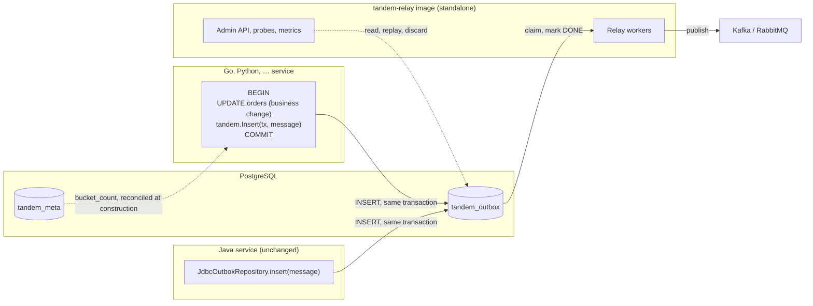

# Tandem: Write-side SDKs for Other Languages

**Version:** 0.1  
**Status:** Accepted. Designed, not implemented.  
**Companion to:** [HLD.md](HLD.md) §1.3, §1.4, §3.2, §4.2, §4.3, §5;
[HLD-managed-seq.md](HLD-managed-seq.md); [LLD-jdbc.md](LLD-jdbc.md) §2;
[LLD-bucket-count-guard.md](LLD-bucket-count-guard.md); [../guide/relay-image.md](../guide/relay-image.md)

This note decides how a service written in a language other than Java writes to the Tandem outbox:
what the write contract is, how an implementation proves it honours it, which languages come first,
and what stays Java-only.

---

## 1. Summary

- Of everything Tandem runs, only the **write side** requires Java. The relay ships as a container
  image (`ghcr.io/alirux/tandem-relay`), the Admin API is HTTP, the CLI is a native binary. The write
  side is the INSERT into `tandem_outbox` that runs inside the application's own transaction, and it
  must run in the application's process and language.
- That INSERT is small and fully determined by data: a 64-bit FNV-1a hash, nine columns, three
  `seq` modes, a header map, and two optional statements (an advisory lock and a wakeup signal).
- Decided: the write side becomes a **published contract** of its own (§4), checked by
  **conformance vectors** that the Java implementation verifies in its own build (§6), and
  implemented by **zero-dependency SDKs**, one per language, starting with **Go** (§7).
- A service in another language deploys the SDK in-process and the relay image beside it: the split
  topology of HLD §3.2, with no new runtime component.
- Out of scope: porting the relay or the Admin API, framework tiers in the style of the Spring
  modules, automatic trace capture, causal ordering, and MySQL until the engine port exists (§9).

---

## 2. Goals and non-goals

**Goals.**

- A service in another language gets the same guarantees as a Java service: the event commits or
  rolls back with the business change, events of one aggregate are published in write order, and the
  message on the wire is the same CloudEvent.
- **Mixed fleets are indistinguishable to the relay.** A Java writer and a Go writer may write to the
  same outbox, and to the same aggregate, and the relay, the Admin API and the CLI cannot tell their
  rows apart.
- The client footprint rule of HLD §1.3 holds in every language: an SDK depends on the language's
  standard database abstraction and standard library, and on nothing else.
- Adding a language is cheap and verifiable: the contract and its vectors are enough to write a new
  SDK without reading Java.

**Non-goals.**

- A relay, an embedded relay or an Admin API in another language. There is one relay
  implementation, and non-Java deployments run it as the image.
- Framework integrations (an equivalent of the template, annotation or application-event tiers).
  An SDK is a function call inside a transaction the caller already holds.
- Any change to the schema, the relay or the published message. The contract below is what the Java
  write side already does, apart from the unit in which it counts lengths, which it aligns with the
  database (§4.1); this design writes the contract down and makes it checkable.

---

## 3. Topology



The database is the only coordination point, as it already is between a Java write side and a
standalone relay (HLD §3.2). The SDK never talks to the relay, the broker or the Admin API.

---

## 4. The write contract

The contract is the set of rows a writer may produce in `tandem_outbox`, plus the statements it may
run around them. It is a subset of the schema contract of HLD §1.4 and evolves under the same rule:
additively only. A future column is optional or defaulted, so an SDK that does not know it keeps
producing valid rows (§8.3).

### 4.1 Columns

A writer names its columns explicitly, never relies on column position, and sets only these:

| Column | Writer supplies | Rule |
|---|---|---|
| `aggregate_id` | always | Non-blank, at most 255 characters. Hashed into `bucket` (§4.2). |
| `aggregate_type` | always | Non-blank, at most 255 characters. |
| `type` | optional | The CloudEvents `type`; at most 255 characters. `NULL` makes the relay fall back to `aggregate_type`. |
| `bucket` | always | Computed by the writer (§4.2). |
| `seq` | depends on mode | See §4.3: bound to a value, bound to `NULL`, or **omitted**. |
| `seq_source` | always | `0` APPLICATION, `1` MANAGED, `2` NONE (§4.3). |
| `payload` | always | UTF-8 JSON text, cast to `jsonb` (§4.4). |
| `headers` | always | A JSON object of string to string, `{}` when empty (§4.4). |
| `correlation_id` | when present | Copy of `headers["correlation-id"]`, truncated (§4.4); `NULL` otherwise. |

Every other column (`id`, `status`, `locked_by`, `locked_until`, `attempts`, `last_error`,
`next_attempt_at`, `created_at`, `discard_reason`, `replays`, and any column added later) belongs to
the database defaults and to the relay. A writer never sets them.

**Lengths are counted in Unicode code points**, the unit in which PostgreSQL (and MySQL with
`utf8mb4`) bounds a `VARCHAR(255)`; every "characters" in this contract means code points. Counting
UTF-8 bytes or UTF-16 code units instead would refuse values the column accepts, and two SDKs
counting differently would disagree on the same message. The Java writer bounds a length itself in
two places, and both follow this rule: `AggregateId` limits the identifier to 255 code points, and
the `correlation_id` copy keeps the first 255 code points (§4.4). Counting UTF-16 code units there
would refuse identifiers the column accepts and could cut a character in half at the truncation
point. The rule only ever accepts more than UTF-16 counting does, so it rejects no message a Java
caller can write today.

### 4.2 The bucket

```
h = 0xcbf29ce484222325                       // FNV-1a 64-bit offset basis
for each byte b of UTF-8(aggregate_id):
    h = h XOR b
    h = h * 0x100000001b3   (mod 2^64)       // FNV-1a 64-bit prime
bucket = floorMod(h read as a signed 64-bit two's-complement integer, bucket_count)
```

`floorMod` is the floor modulus: the result is always in `[0, bucket_count)` and has the sign of the
divisor. This is the definition the Java writer uses (`BucketHash`), and the bucket is baked into
every stored row for the life of the data, so the definition can never change.

**The trap every port must avoid.** Reducing the **unsigned** 64-bit value instead of the signed one
gives the same bucket whenever `bucket_count` is a power of two, and a different one otherwise. With
the default of 256 the two agree, so a port tested only at the default looks correct and silently
misroutes rows on a deployment configured with any other count. Example: `aggregate_id = "order-7"`
hashes to `0xdee47a9f34bede3b` (top bit set). At `bucket_count = 256` both reductions give `59`; at
`bucket_count = 100` the signed floor modulus gives **`43`**, the unsigned remainder gives `59`. The
conformance vectors (§6) therefore include non-power-of-two counts and hashes with the top bit set.

A misrouted row is not lost, but it lands in a bucket owned by the wrong worker, which breaks the
per-aggregate exclusivity the relay's ordering rests on (HLD §4.3) whenever a Java writer and the
port write the same aggregate.

### 4.3 The three `seq` modes

A message states exactly one mode; there is no default (HLD-managed-seq §4.6). The mode decides what
the writer does with two columns:

| Mode | `seq` | `seq_source` | Meaning |
|---|---|---|---|
| APPLICATION | bound to the caller's value | `0` | The aggregate's own number, usually its version. |
| MANAGED | **omitted from the column list** | `1` | The column default (`nextval('tandem_seq')`) assigns it. |
| NONE | bound to SQL `NULL` | `2` | No number; consumers deduplicate on the event id. |

Omitting and binding `NULL` are different instructions, and the difference is the whole mechanism:
omitting fires the default, binding `NULL` stores none. The table's check constraint
(`(seq IS NULL) = (seq_source = 2)`) rejects a MANAGED row bound to `NULL` and a NONE row that drew a
number. It cannot catch one mistake: an APPLICATION row with `seq` omitted draws a managed number and
still claims APPLICATION. An SDK must therefore build the statement from the mode, never from
whether a value happens to be present.

### 4.4 Payload and headers

- **`payload`** is the already-serialized event, sent as UTF-8 JSON text and cast to `jsonb`.
  PostgreSQL rejects anything that is not JSON. It stores the parsed value, so what the relay
  publishes is semantically equal to what was written but not byte-identical. The `bytea` payload
  column HLD §5.2 allows for binary serializers is not part of the contract, because the Java writer
  does not support it either; it reaches the SDKs when it reaches Java.
- **`headers`** is a JSON object of string to string, written as `{}` when empty, never `NULL`.
  These names are part of the contract (`TandemHeaders`):

  | Header | Read by the relay as |
  |---|---|
  | `content-type` | CloudEvents `datacontenttype` |
  | `dataschema` | CloudEvents `dataschema` |
  | `correlation-id` | passthrough header; also copied to the `correlation_id` column |
  | `traceparent`, `tracestate` | W3C Trace Context, passthrough |
  | `causation_id` | reserved; nothing writes it today |

  An SDK offers typed setters for `content-type` and `dataschema`; a value set through them
  overrides an entry of the same name in the caller's header map, as in Java.
- **`correlation_id`** repeats `headers["correlation-id"]` so the Admin API can search by it. The
  value usually comes from outside the application, so it is untrusted: the column copy is truncated
  to its first 255 code points (§4.1); the header keeps the full value.

### 4.5 The statements

A row in APPLICATION or NONE mode:

```sql
INSERT INTO tandem_outbox (aggregate_id, aggregate_type, type, bucket, seq, seq_source,
                           payload, headers, correlation_id)
VALUES ($1, $2, $3, $4, $5, $6, CAST($7 AS jsonb), CAST($8 AS jsonb), $9)
```

A row in MANAGED mode, the same statement without `seq`:

```sql
INSERT INTO tandem_outbox (aggregate_id, aggregate_type, type, bucket, seq_source,
                           payload, headers, correlation_id)
VALUES ($1, $2, $3, $4, $5, CAST($6 AS jsonb), CAST($7 AS jsonb), $8)
```

A batch may mix modes; it then runs one statement shape per run of consecutive rows sharing a shape,
in the order given, so insert order, and with it commit order within one transaction, is the order the
caller supplied.

### 4.6 Serialising writers: `lockedWrite`

A message may ask for concurrent writers to the same aggregate to be serialised
(HLD-managed-seq §4.2). The writer then runs, on the same connection and inside the caller's
transaction, before the insert:

```sql
SELECT pg_advisory_xact_lock(hashtext($1))   -- $1 = aggregate_id
```

- The lock key is computed **by this SQL expression, never in the SDK**. That is what makes a Java
  writer and a Go writer to the same aggregate wait for each other.
- In a batch, every lock the batch needs is taken **before any row is inserted**, in ascending order
  of `aggregate_id` compared by UTF-16 code units (the Java order). For identifiers without
  characters above U+FFFF this equals byte order. A writer that orders differently costs at worst a
  deadlock, which PostgreSQL detects and aborts; it never produces a wrong row.
- The lock is released by the commit or rollback of the caller's transaction; there is no unlock
  statement.

### 4.7 The bucket count

`bucket` depends on `bucket_count`, which must equal the relay's and can never change after the first
deployment. The stored value lives in `tandem_meta` under the key `bucket_count`
(LLD-bucket-count-guard §5).

An SDK handles it exactly as the Java write side does:

- The count is an optional setting with the Java default, **256**, so a deployment that keeps the
  default configures nothing, in any language.
- When the SDK is constructed it runs the reconciliation the Java components run (`seedOrValidate`,
  LLD-bucket-count-guard §3.1): it seeds the configured value when none is stored, proceeds when the
  two are equal, and fails construction when they differ. The failure names both values and says that
  the stored one cannot change.
- Seeding leaves the start order free: on a new database a writer may start before any relay has
  run, as a Java writer can.

The check runs once, outside any caller transaction, on a connection of its own:

```sql
SELECT value FROM tandem_meta WHERE key = 'bucket_count'
INSERT INTO tandem_meta (key, value) VALUES ('bucket_count', $1) ON CONFLICT (key) DO NOTHING
```

The value is stored as decimal text. After seeding, the SDK reads the value again and reconciles
against what it finds there, so of two writers seeding a new database at the same moment with
different counts, the one that lost the insert fails instead of writing rows with its own count.

Because this check needs a connection outside any transaction, an SDK's constructor takes the
language's connection pool (in Go, the `*sql.DB`), while every insert takes the caller's transaction
(§5.1). The Java writer cannot read at construction, since its `DataSource` may only yield a
connection inside a caller transaction; its Spring tier runs the same guard on the underlying pool
before building it. The behaviour is the same; only where the check sits differs.

### 4.8 The optional wakeup

When the caller opts in, the writer signals the relay once per insert call, after its rows and in the
same transaction, with the distinct buckets it wrote:

```sql
SELECT pg_notify('tandem_wakeup', bucket::text) FROM unnest($1::int[]) AS bucket
```

The channel name `tandem_wakeup` and the payload (one bucket number as decimal text) are part of the
contract. The signal only shortens latency for a relay running with the wakeup enabled; a relay that
is not listening finds the rows on its next poll. Like any statement in the transaction, a failing
notify fails the transaction.

### 4.9 Failures

| Condition | Detected by | SDK reports |
|---|---|---|
| Invalid message: blank `aggregate_id` or `aggregate_type`, `aggregate_id` over 255 characters, no payload, no `seq` mode or more than one | the SDK, before any statement | a validation error |
| `(aggregate_id, seq)` already exists | SQLSTATE `23505` | a duplicate-seq error |
| Payload is not JSON | SQLSTATE `22P02` | an insert error |
| `aggregate_type` or `type` longer than its column | SQLSTATE `22001` | an insert error |
| Configured bucket count differs from the stored one | construction (§4.7) | a configuration error |
| Any other database error | the driver | an insert error wrapping the driver's |

Every error carries `aggregate_type`, `aggregate_id` and the `seq` value or mode, and never the
payload or a header value (the logging rules apply to error text as they do to `toString()`). A MANAGED
message has no number until its insert succeeds, so its error names the mode, not a number.

---

## 5. SDK design rules

### 5.1 Join the caller's transaction; never own one

An SDK never begins, commits or rolls back. It executes on the transaction handle the caller passes,
because the atomicity of the business change and the event is the whole point of the pattern.

Where the language's type system can demand a transaction, the SDK demands it: the Go SDK takes a
`*sql.Tx`, so calling it outside a transaction does not compile. Where it cannot, the SDK checks
what the driver exposes (an autocommit flag, for example) and refuses a handle that would commit
each statement on its own.

### 5.2 Footprint

HLD §1.3 applied per language: the standard database abstraction and the standard library, and
nothing else. No Kafka client, no CloudEvents library, no tracing library, no JSON binding beyond the
standard one, no framework. Support for a popular native driver whose types the standard abstraction
does not cover is a separate, optional package of the same SDK, so a caller who does not use that
driver never downloads it.

| Language | Database abstraction | JSON | FNV-1a |
|---|---|---|---|
| Go | `database/sql` (`*sql.Tx`) | `encoding/json` | `hash/fnv` (`New64a`) |

Further rows are added by the design of each language (§7).

The first Go release supports `database/sql` only. An application using `pgx` through its
`database/sql` driver (`pgx/v5/stdlib`) uses the SDK as it is; one that holds a native `pgx.Tx`
waits for the optional `pgx` package, which follows when there is demand for it.

### 5.3 The same message model as Java

An SDK exposes the message the way `OutboxMessage` does, in the language's idiom: required
`aggregate_id`, `aggregate_type` and payload; optional `type`, `content-type`, `dataschema` and
headers; exactly one of the three `seq` modes, with no default and an error naming all three when
none is stated; an optional `lockedWrite`. Two SDKs presenting the same concepts under the same names
let documentation, examples and support answers carry over between languages.

### 5.4 No logging

An SDK does not log. It returns errors (§4.9) and leaves routing them to the application, which is
the same posture as the library, which ships no logging configuration ([HLD-logging.md](HLD-logging.md)).

---

## 6. Conformance

The contract is checked, not described.

**Vectors.** A directory, `schema/write-side/`, holds machine-readable cases in JSON. It sits beside
`schema/postgres/` rather than inside it because the write contract is part of the schema contract
and its expected values do not depend on the engine: the same vectors serve every engine Tandem
supports, and an SDK's tests take both the schema to apply and the cases to check from `schema/`.
Only `schema/postgres/changelog/` is packaged into `tandem-jdbc`, so the vectors never reach a
published artifact.

- **bucket vectors:** `(aggregate_id, bucket_count) → bucket`, covering ASCII, two-, three- and
  four-byte UTF-8 characters, a 255-character identifier, hashes with the top bit set, and bucket
  counts that are not powers of two (1, 7, 100, 1000, 32767) as well as the default 256;
- **row vectors:** a message, a bucket count and the expected stored row: `bucket`, `seq`,
  `seq_source`, `type`, `headers` compared as a JSON object, and `correlation_id`, including every
  `seq` mode, a truncated correlation id, and one whose 255th code point lies above U+FFFF;
- **rejection vectors:** messages an SDK must refuse before any statement, and rows the database
  must refuse (a duplicate `seq`, a non-JSON payload). The length unit of §4.1 is pinned from both
  sides: an `aggregate_id` of 255 code points that is longer than 255 in UTF-16 code units and in
  bytes is accepted, and one of 256 code points is refused.

**The Java build verifies them.** `tandem-core`'s tests run every bucket vector through `BucketHash`,
and `tandem-jdbc`'s integration tests insert every row vector with `JdbcOutboxRepository` and compare
the row read back. A change to the Java write side that alters the contract fails the build that made
it, so the vectors cannot drift from the reference implementation.

**Each SDK verifies them too**, in three layers:

1. the bucket and rejection vectors, as unit tests;
2. the row vectors, inserted into a real PostgreSQL built from `schema/postgres/tandem-baseline.sql`
   (the generated current schema) and, separately, from the schema at the SDK's declared floor (§8.3);
3. one end-to-end test: the SDK writes, the latest released `tandem-relay` image publishes to Kafka,
   and the test checks that the CloudEvent it reads is the one the same message produces when written
   by Java. The latest release, not a pinned one, because it is what an adopter runs. A contract
   change ships in a library release first and reaches the image after it, so an SDK adopts the change
   once the image carrying it is out.

An SDK is conformant when all three pass. That is also the acceptance bar for a contributed one (§7).

---

## 7. Languages

**Go first.** The repository already builds, tests and releases Go (`tandem-cli`), so CI and release
tooling exist; Go is a common language for services that run on PostgreSQL and Kafka; and its standard
library covers the whole writer, including FNV-1a.

**Further languages on demand.** An issue describing a real use case in a language is what starts its
design. The likely candidates are Python, TypeScript and .NET, each of which has a standard or
dominant database abstraction to build on. Each one gets a short design of its own (driver
abstraction, transaction handle, package name and registry, release workflow) before any code.

**Contributed SDKs** are accepted on conformance: the vectors and the end-to-end test of §6 pass, the
footprint rule of §5.2 holds, and the README states who maintains it. Because the contract only grows
additively, an SDK that nobody updates keeps producing valid rows against newer releases of Tandem;
it lacks newer optional features, and it never breaks. A stale SDK therefore never blocks a library
release.

---

## 8. Repository layout, versioning and releases

### 8.1 Layout

SDKs live in this repository, one directory per language under a new role directory, `sdks/`
(`sdks/go/`, …), plural like the existing `libs/`, `apps/`, `examples/` and `tools/`, and outside the
Gradle build like `apps/tandem-cli/`. The role is added to the role directories AGENTS.md lists. The
conformance vectors live in `schema/write-side/` (§6). Keeping the contract, its Java reference and
every SDK in one repository is what lets a single change move all three and lets one CI run verify
them together.

An SDK is registered like the other independently versioned modules: in the project layout of
`.github/CONTRIBUTING.md`, in `THIRD-PARTY-NOTICES.md` (stating that it carries no third-party
dependency), and in the README. It is not a Gradle module, so it stays out of `settings.gradle.kts`,
the BOM and the JaCoCo aggregation; its coverage is uploaded to Codecov by its own CI job, as the
CLI's is.

### 8.2 Go module and tags

- Module path: `github.com/alirux/tandem-transactional-outbox-kafka/sdks/go`, matching the directory,
  which is what lets `go get` resolve it.
- Versions are tags of the form `sdks/go/vX.Y.Z`, the form Go requires for a module in a subdirectory.
  They do not match the library's `v*` release trigger, the CLI's `cli-v*` or the relay's `relay-v*`,
  so no release path fires on another's tag.
- A major version from 2 upward requires the `/v2` suffix in the module path, or the Go module proxy
  refuses the version outright. The SDK therefore stays on major 1 for as long as possible, and the
  first `v2` tag ships in the same change as the path suffix.

### 8.3 Versioning

Every SDK is versioned independently of the library, with semantic versioning, like `tandem-cli` and
`tandem-rabbitmq`. Its compatibility contract has two parts:

- **its own API** in its language;
- **its schema floor:** the oldest Tandem schema it can write to, stated as a changeset and the
  library release that first shipped it. For an SDK written against today's contract the floor is
  `v4-optional-seq` (first released in library v0.8.0), because `seq_source` exists and is required
  from that changeset on.

Raising the floor is a minor version of the SDK, never a patch, and the release notes state the floor
of every release. A newer schema never breaks an SDK, by the additive rule of HLD §1.4.

---

## 9. What stays Java-only, and why

- **The relay, embedded or standalone.** Sharding, leases, ordering detection and the broker adapters
  are the hard part of Tandem and the part that benefits most from a single implementation. It ships
  as an image; a non-Java service runs it beside itself.
- **Framework tiers.** The Spring tiers exist because Spring is the dominant way to write a Java
  service. No equivalent exists across the other languages, and an SDK that is a function call inside
  the caller's transaction serves every framework of its language at once (HLD §1.1).
- **Automatic trace capture.** The Java writer can read the current OpenTelemetry context
  (HLD §7.1). An SDK's first version leaves `traceparent`, `tracestate` and `correlation-id` to the
  caller, who sets them as headers; automatic capture is a later, optional package of the SDK, since
  it needs the language's OpenTelemetry library.
- **Causal ordering.** It is designed but not built in Java either (HLD §9). It reaches an SDK after
  it ships in Java, as an additive change to the contract.
- **MySQL.** The contract in §4 is PostgreSQL's. When the MySQL port exists, the contract gains an
  engine section (its JSON type, its lock function, no `pg_notify`), the vectors gain a MySQL run, and
  each SDK adds the engine.

---

## 10. Rejected alternatives

- **Publish the contract, ship no SDKs.** Rejected because the contract has sharp edges that fail
  silently: an APPLICATION row with `seq` omitted (§4.3), an unsigned bucket reduction (§4.2), a
  bucket count used without being reconciled with the stored one (§4.7). Every adopter would meet them
  alone. The contract is still published, for languages that have no SDK yet, and the SDK is the
  recommended path wherever one exists.
- **A database function (`tandem_insert(...)`) that computes the bucket in SQL**, so that any language
  needs only a SQL call. Rejected: PostgreSQL's `bigint` raises an error on overflow instead of
  wrapping, so FNV-1a 64 would have to run in `numeric` arithmetic modulo 2^64, byte by byte; MySQL
  would need a second implementation; and the function would be a new schema object to version and
  grant. Computing the bucket in application code is what keeps the stored value independent of the
  engine and its version (HLD §4.3).
- **A write service over HTTP or gRPC.** Rejected: the event would commit in a different transaction
  from the business change, which is the double write the pattern exists to remove (HLD §2.1).
- **One native core bound into every language (FFI).** Rejected: a native build per platform, binary
  artifacts in every registry, and an install that is no longer plain source, to share logic of a few
  hundred lines that is cheaper to write than to bind.
- **One repository per SDK.** Rejected: a contract change, its Java reference and the SDKs would move
  in separate changes, and nothing would run the vectors against Java and every SDK in the same build.

---

## 11. Open points

- **Python and TypeScript abstractions.** Python's DB-API leaves the placeholder style to each driver,
  and some widely used drivers are not DB-API at all; TypeScript has no standard database interface.
  Each is decided in that language's own design (§7).
