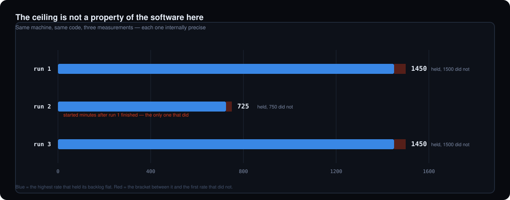

# Archived benchmark runs

The raw output behind every performance figure Tandem publishes — the README's
[Measured performance](../../README.md#measured-performance) section, the charts in
`docs/tandem-benchmark-*.svg`, and the page at
[tandem.codingful.com/performance](https://tandem.codingful.com/performance/). HLD-load-testing §7
asks for results to be archived for regression tracking; this is where they go.

**The headline finding is a negative one.** On this host the throughput ceiling is **not
reproducible** — three measurements gave 1450, 725 and 1450 events/s, each internally precise to
within 3%. Latency, measured at a fixed load, *is* reproducible: three runs agree to within about a
millisecond at the median. Correctness never wavered in any run at any rate. Read the sections below
before quoting any number from here.

## The host

AWS `m7i-flex.large` — 2 vCPU, 8 GB, Ubuntu 24.04 with **native** Docker (no virtualisation layer
between the containers and the disk, unlike Docker on macOS), `eu-central-1`. PostgreSQL, Kafka, the
relay and the load driver all share the machine, which costs throughput but is what lets COMMIT→ack
be measured against a single clock ([HLD-load-testing §2.3](../HLD-load-testing.md)). Relay settings
are the harness defaults: 8 workers, batch 100, 256 buckets, 1 KB payloads, `acks=all`,
`enable.idempotence=true`.

### ⚠️ Why the ceiling does not reproduce

`m7i-flex.large` is **burstable**: it guarantees a 40% CPU baseline and allows bursting above it for
most of a 24-hour window, and AWS notes that instances held above baseline for long periods "might
see a gradual reduction in the maximum burst CPU throughput". Three of the four ceilings measured
across this session cluster at 1300–1450; the outlier at **725** came from the only run that started
immediately after a fifteen-minute stretch at 85%+ CPU.



That chart lives here rather than in the README or on the site: it is a record of how the host
behaved during this session, not a result about Tandem.

Stronger still, the capacity moved **inside a single run**. In the superseded run kept below, S1
measured that 800 events/s could not be held at 13:18, and three minutes later S2's own ramp held
800 and then 1200 on the same host. That is not measurement noise between runs; it is the machine
changing underneath one.

`cpu_steal` was sampled for part of the session and is **0.00 in 396 of 399 samples**, so whatever
the mechanism is, it does not surface as hypervisor-stolen scheduler time — consistent with a
frequency or entitlement effect rather than contention this guest can see. The cause is therefore
inferred from AWS's documented behaviour and the timing, not directly observed.

**What this means for the numbers:** no single throughput figure from this host is a property of
Tandem. Settling it needs an instance with dedicated cores, which this account cannot launch — it is
on the current AWS Free plan, where every eligible type is burstable (the flex pair and the T family)
and a non-eligible type is refused outright (`InvalidParameterCombination ... not eligible for Free
Tier`) rather than billed.

## What is here

| Directory | Run | What it backs |
|---|---|---|
| `2026-08-28-run1/` | S1 + S2, `--duration=240` | Ceiling #1 (1450/s), one of the three latency replicates, and the per-rate CPU/disk chart |
| `2026-08-28-run2/` | S1 + S2, `--duration=240`, started right after run 1 | Ceiling #2 (**725/s**) — the throttled outlier, and a latency replicate |
| `2026-08-28-run3-suite/` | All seven scenarios, `--duration=180`, with per-scenario reset | Ceiling #3 (1450/s), the third latency replicate, and the whole correctness table |
| `2026-08-30-endurance/` | S9, six hours at a fixed 400 events/s, on a Mac | The endurance result: no drift in throughput, latency, bucket coverage or storage — and the concurrent-cleanup deadlock it surfaced. Has its own [README](2026-08-30-endurance/README.md) |
| `2026-08-30-poll-interval/` | Ceiling at 100 ms vs 10 ms poll interval, drained and blocked outbox, on a Mac | Whether a short poll interval costs delivery capacity (it does not) and what a blocked outbox costs (a fifth to a quarter of the ceiling). Has its own [README](2026-08-30-poll-interval/README.md) |
| `superseded/` | One earlier full-suite run | Evidence for a harness defect, not results — see below |

Each directory holds the harness's own stdout (`loadtest*.log`), host resource samples
(`resources.csv`) and per-container samples (`containers.csv`). `2026-08-30-endurance/` differs: it
ran on a different host with a different instrument, and names its own files in its README.

`2026-08-28-run3-suite/` is split across two log files for one reason worth stating: `loadtest-s1-s4.log`
is the full-suite run, and `loadtest-s5-s6-s8.log` is the immediate re-run of the last three
scenarios after a fix (see "the reset that broke S8"). Both used per-scenario reset; the second
simply also had the corrected lease handling.

## Reading `resources.csv`

One row roughly every 5 s. **The column set changes between runs**: `cpu_steal` was added mid-session,
so run 1 and run 2 have ten columns and the suite run has eleven. Read columns by header name, never
by position — `render-charts.py` does.

- **CPU (`cpu_usr`, `cpu_sys`, `cpu_iowait`, `cpu_steal`, `cpu_idle`)** — from `mpstat`, whose
  `Average:` line covers the sampling interval. Sound.
- **Memory (`mem_used_mb`, `mem_avail_mb`)** — from `free -m`, instantaneous. Sound.
- **Disk (`disk_read_kbps`, `disk_write_kbps`, `disk_util_pct`)** — from `iostat -dxk 1 2`, keeping
  the **second** report. Sound in these runs, and worth knowing why that matters: an earlier sampler
  used `iostat 1 1`, whose single report covers time since boot rather than the interval, and its
  flat output was published as "the disk stayed under 3% busy" before anyone noticed the column
  barely moved while CPU swung from 0.5% to 61%.

`disk_read_kbps` is legitimately near-zero in the suite run: an outbox workload is write-heavy and by
then the page cache was warm. That is the workload, not a dead sensor — its write column takes 168
distinct values over the same run.

## Reading `containers.csv`

Per-container CPU and memory from `docker stats`. **Of limited use as archived:** the container
column carries Docker's generated names (`adoring_rosalind`, …) because Testcontainers does not name
its containers, so PostgreSQL cannot be told from Kafka without inference. A future sampler should
record the image instead. It is kept because the totals are still informative and because deleting a
column is a worse habit than labelling it.

## Why `superseded/` exists

`2026-08-28-no-reset-cascade.*` is a full-suite run from before scenarios were isolated from each
other's *state*. Scenarios share one `BenchmarkEnvironment`, and sharing it meant sharing its
contents: S4 saturates deliberately and, on two cores, could not work its backlog off inside its
window — so S5 inherited those rows and missed its own deadline, then S6, then S8. Four consecutive
failures, none of them a property of the code under test.

It is archived because [LLD-benchmark §8](../LLD-benchmark.md) now makes a claim about that cascade,
and a claim about a measurement should be checkable against the measurement. Do not quote it as
results. `LoadTestRunner` now truncates the outbox before each scenario, and the same three scenarios
pass cleanly in `2026-08-28-run3-suite/`.

**The reset that broke S8.** The first version of that fix also truncated `tandem_bucket_lease` — but
its rows are not runtime state: the baseline DDL seeds exactly one per virtual bucket, and a `LEASE`
relay refuses to start unless it finds `bucketCount` of them. S8 stopped at startup with a
configuration error naming the cause, the expected count and the remedy, which is the guard behaving
exactly as designed. The fix now clears the ownership columns and leaves the seed rows alone.

## The logs are filtered, and here is exactly how

Each `.log` is the harness's real stdout with **one** line pattern removed:

```
FINE    com.codingful.tandem.jdbc.WorkerPool - Worker claimed rows workerIndex:N, claimed:N
```

Emitted once per worker per poll cycle, it is 99.9% of the bytes (a run is ~10 MB raw, ~11 KB without
it) and carries no result, only the fact that polling happened. Everything else is untouched. To
reproduce the filter:

```bash
grep -vE "FINE +com\.codingful\.tandem\.jdbc\.WorkerPool - Worker claimed rows" loadtest.log
```

`resources.csv` and `containers.csv` are unmodified.

## Redrawing the charts

`render-charts.py` regenerates all four SVGs into `docs/`, **parsing the archived files** rather than
carrying transcribed numbers — ramp traces and percentiles out of the logs, per-rate resource windows
out of the CSVs, and the ceiling brackets out of which rates held:

```bash
python3 docs/benchmark-results/render-charts.py
```

Standard library only. It refuses to draw from a channel that never moved
(`assert_channels_live`), so a sampler that silently stops measuring fails the redraw instead of
producing a plausible chart. Making it parse rather than trust a transcription immediately caught two
errors in the first hand-written version of these charts.

## Reproducing a run

```bash
./gradlew :tandem-benchmark:loadTest --args="--duration=240 S1,S2"     # throughput + latency
./gradlew :tandem-benchmark:loadTest --args="--duration=180"           # the whole suite
```

Requires Docker. Sample resources alongside it with the archived instrument, which also knows how to
check itself:

```bash
./docs/benchmark-results/sample-resources.sh --self-test   # prove each channel responds
./docs/benchmark-results/sample-resources.sh ./out         # then sample into ./out
```

The self-test writes 512 MB and spins a core, and fails if the sampler does not see either. Run it
before trusting a run's resource data: on the original broken sampler it reports disk utilisation
unchanged at 4.82% while 512 MB is being written, and exits non-zero.

Expect different absolute numbers on different hardware. What should hold anywhere is the shape: a
bracketed ceiling with a stated error bar, CPU rising with the offered rate, and zero ordering
violations and zero lost events at every rate — including the ones the relay cannot keep up with.
