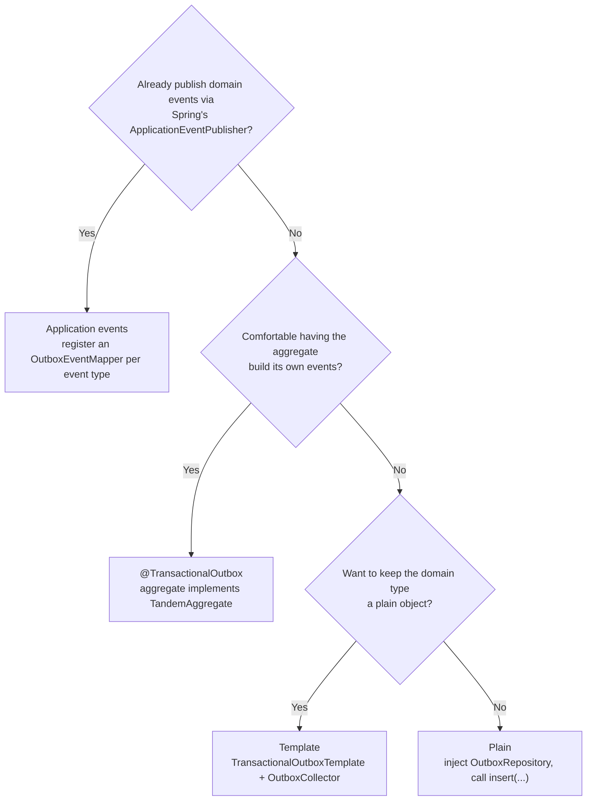
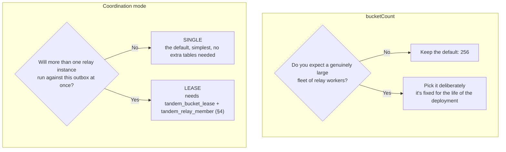

# Tandem: Brownfield Adoption Guide

---

## 0. Who this guide is for

The [README](https://github.com/alirux/tandem-transactional-outbox-kafka/blob/main/README.md#try-it) answers *"does Tandem
work?"*: five minutes, a fresh database, a toy aggregate.

!!! question "The question this guide answers"
    You already have forty aggregates in production, a real domain model, maybe a Kafka producer
    that already exists. **What does adopting Tandem actually cost, and what can it break?**

Two decisions drive everything below, and they're independent; conflating them is the most
common way to over-scope this work:

1. **Which write-side tier to use**: how much of your domain code touches Tandem's API at all.
   → [§3.1](#31-which-write-side-tier)
2. **Where `seq` comes from (or whether you have one at all) and whether you need Tandem's
   write lock**: a correctness question, orthogonal to the tier. → [§3.2](#32-where-seq-comes-from-and-whether-you-need-tandems-lock)

Start with §1: one precondition to check before either decision matters.

---

## 1. The one precondition that can actually block you

Everything else in this guide is additive, opt-in, or has a documented workaround. This one isn't:

!!! danger "Hard precondition, not a suggestion"
    **Within one aggregate, commit order must equal the order the events were written in.**

    Here's why: without it, an earlier row can become durable *after* a later one, and no relay
    model can repair an ordering defect already baked into the committed data. Tandem relays in
    `id` order and rejects a duplicate `seq` where one is supplied; it does not *create* order.
    This holds whichever `seq` mode you pick ([§3.2](#32-where-seq-comes-from-and-whether-you-need-tandems-lock)):
    a sequence number **records** the order, it does not **impose** it.

**Check your existing write path against these four shapes**, most common first:

1. **You already take a pessimistic lock or an optimistic version check on the aggregate root for
   every mutating transaction.** Your existing locking already serializes writers, so Tandem's
   ordering guarantee holds for free the moment you insert the outbox row inside the same
   transaction.
2. **You use a JPA `@Version` (or equivalent ORM optimistic lock) on the aggregate root.** Check
   *when* your write-side code reads the version relative to the flush. Hibernate (and most JPA
   providers) advance `@Version` at **flush**, not at the point you call the mutator method, so
   reading it before an explicit flush hands Tandem the *pre-increment* value, and the same flush
   timing also decides whether the row lock is taken before the outbox insert. This is the single
   most common trap for a Spring/JPA brownfield adopter, and it is **not tier-specific**: every
   write-side tier in §3.1 inherits it identically.
3. **Your writers only ever touch a *child* of the aggregate** (an order line, an item appended to
   a collection) **and never the aggregate root itself.** No amount of flushing helps here: there
   is no shared row to lock, so concurrent writers on the same aggregate can still commit out of
   order.
4. **You have no serialization at all today** (no lock, no version, genuinely concurrent blind
   writes). This is not a Tandem-specific gap: your domain already tolerates last-write-wins races on
   this aggregate, and Tandem cannot manufacture an ordering guarantee your domain never had.

| Your shape | What it costs you |
|---|---|
| 1: already serialized | Adoption is close to free. |
| 2: JPA `@Version` | A five-minute fix once found (flush earlier, or stop supplying a version with `unsequenced()`, §3.2), but **silent if missed**. |
| 3: child-only writes | Budget real design time: add an explicit `SELECT … FOR UPDATE` on the aggregate row, redraw the aggregate boundary, or opt into `lockedWrite()` (§3.2), the only option needing no shared domain row, since its lock is keyed on the aggregate id. |
| 4: no serialization | Same fix as case 3. `lockedWrite()` is the fastest way to add ordering without touching your persistence layer. |

!!! warning "Verify it before you trust it"
    Don't take this checklist's word for it in a business-critical migration; write the
    two-writer test Tandem's own test suite uses for this (`CommitOrderReorderIT` is the pattern):
    two concurrent transactions on the same aggregate, assert they publish in the order they were
    meant to. A passing functional suite proves nothing here: `UNIQUE(aggregate_id, seq)` and the
    head-of-chain check both stay silent on a reorder that happened only in commit timing.

---

## 2. The rest of the checklist

Quick, and none of these block adoption outright; each has a documented answer.

| Precondition | How to check it | If it's missing |
|---|---|---|
| The write happens inside a relational transaction you control | You already call `@Transactional` (or open the tx yourself) around the domain mutation | No path around this: it's the outbox pattern's entire premise |
| A stable identifier per aggregate, ≤ 255 chars | Your aggregate root already has a primary key or natural id | Almost always available; see §6 if genuinely no aggregate exists |
| *(nothing: a `seq` source is optional)* | See §3.2 | `unsequenced()` needs no version and no domain-schema change; supply one only if consumers read it |
| A path to apply additive DDL to a live database | See §4 | Tandem's schema is a normal Liquibase changelog; any migration tool can consume the generated flat SQL |
| Whether this data is *already* published to Kafka by something else | Check for an existing producer on this topic | See §5, the strangler cutover |
| A broker Tandem has an adapter for | You publish to Kafka (`tandem-kafka`) or RabbitMQ (`tandem-rabbitmq`, independently versioned and not yet on Maven Central) | Another broker needs its own transport adapter: see [Publishing Your Own Message Format](message-format.md) §1 |

---

## 3. Two independent decisions

### 3.1 Which write-side tier

Four tiers exist, in increasing abstraction, and **an application can mix them per aggregate
type**: this is not an all-or-nothing choice.

**Pick one based on how much of your domain code you're willing to touch:**



- **Won't touch the domain model at all, want the outbox row explicit at the call site?**
  → **Plain**: inject `OutboxRepository`, call `.insert(...)` inside your existing
  `@Transactional` method. No annotation, no Spring autoconfiguration beyond wiring the bean.
  Works identically outside Spring.
- **Want to keep building a plain domain object, but move the "what event does this transaction
  produce" decision out of the entity?**
  → **Template** (`TransactionalOutboxTemplate` + `OutboxCollector`): your domain type stays a
  plain object; you call `outbox.record(...)` at the point in the code that already knows what
  happened. The least invasive tier that still gets object-payload serialization for free.
- **Comfortable having the aggregate build its own events, and want one annotation to replace
  `@Transactional`?**
  → **`@TransactionalOutbox`**: the aggregate implements `TandemAggregate`
  (`pendingOutboxMessages()`), the annotation extracts and inserts after the method returns, still
  inside the transaction.
- **Already publish domain events via Spring's `ApplicationEventPublisher`** (Spring-Modulith-style,
  or just idiomatic Spring)?
  → **Application events**: register an `OutboxEventMapper<T>` per event type; existing
  `publishEvent(...)` call sites need no change at all. The cheapest integration when the pattern
  is already there.

### 3.2 Where `seq` comes from, and whether you need Tandem's lock

Independent of the tier, and independent of *each other*: two separate decisions, not one axis.

**Decision one: where the sequence number comes from.** Every message states one of three modes
and there is no default, because the choice fixes what your consumers read and cannot be changed
later without breaking them:

| Mode | Use it when | What it costs |
|---|---|---|
| `unsequenced()` | **Start here when undecided.** Your consumers deduplicate on the event id and never read the aggregate's version, the common case. | Nothing. The row stores no number and publishes no `ce_seq`. |
| `seq(long)` | Consumers genuinely read the number as your aggregate's version, **or** you want the strongest ordering detection: only a number *you* assigned is an order independent of the one rows were inserted in. | You must keep the version in step with your ORM's flush; the §1 case-2 trap above is exactly this. |
| `managedSeq()` | Consumers want *a* monotonic number but attach no domain meaning to it, and your aggregate has no version to give. | Nothing on the write path: a database sequence default supplies it. |

Two questions settle it:

1. Do consumers need your aggregate's **domain version**? → `seq(long)`.
2. If not, do they need **any** number at all? → `managedSeq()` if yes, `unsequenced()` if no.

`managedSeq()` and `unsequenced()` give **identical** ordering detection; they differ only in
whether a number reaches the consumer.

**Decision two: whether Tandem serializes your writers.** `lockedWrite()` is a separate per-message
flag that combines freely with any of the three modes above. Reach for it when writers to one
aggregate don't reliably serialize (§1 case 3 or 4) and you'd rather Tandem's advisory lock
enforce the precondition than establish it yourself.

All of it is **per message**: one aggregate type can be `unsequenced()`+`lockedWrite()` while
another keeps its app-assigned `seq` and no lock, in the same application.

!!! warning "Don't reach for `lockedWrite()` by default"
    It is a real behavioral change (concurrent writers to the same aggregate now wait on each
    other), not a free correctness upgrade. Use it only where §1's checklist actually found a gap.

---

## 4. Applying the schema to a database that already has data in it

Tandem's schema is additive-only by design and lives as a normal Liquibase changelog, not
something the library applies itself: you (or your existing migration tool) run it, exactly like
every other table in your schema.

**Which migration tool are you on?**

- **Already on Liquibase?** Point `liquibase update` (or `spring.liquibase.change-log`) at
  `classpath:tandem/schema/postgres/changelog/db.changelog-master.xml`. It ships inside the
  `tandem-jdbc` jar, so there's nothing to copy into your own repository. Change tracking and
  checksums work exactly as they do for your own changelogs; each Tandem release only ever
  *appends* a new versioned changeset.
- **On Flyway, or a hand-rolled migration runner, or applying SQL by hand?** Use the generated
  flat file, [`schema/postgres/tandem-baseline.sql`](https://github.com/alirux/tandem-transactional-outbox-kafka/blob/main/schema/postgres/tandem-baseline.sql),
  as one ordinary migration (a `V<n>__tandem_baseline.sql` for Flyway, or whatever your tool's
  convention is). It's a single all-or-nothing script: `tandem_outbox` and `tandem_meta` (used by
  every deployment) plus `tandem_bucket_lease` and `tandem_relay_member` (only populated if you
  ever run multi-instance `LEASE` coordination, but created regardless, since there's no smaller
  variant to apply).
- **Already applied the flat baseline once and want to move onto the Liquibase changelog?** One
  `liquibase changelog-sync` records the changesets as already applied, without re-running the
  DDL.

Nothing here needs a maintenance window beyond whatever your tooling already needs for an
additive migration: new tables, no touched ones.

---

## 5. The strangler cutover: replacing a hand-rolled Kafka producer

Skip this section if you're not already publishing this data to Kafka; go straight to §6 (still
relevant regardless of an existing producer) or §7. If you are, read both boxes below before you
start, in that order.

!!! success "The good news: the wire format is a smaller obstacle than it looks"
    Tandem publishes CloudEvents in **binary mode**: CloudEvents attributes become `ce_*` Kafka
    headers, and the message **body stays your raw payload, untouched**. An existing consumer
    that reads the body and ignores headers keeps working through the cutover with zero changes.
    Topic naming is a `TopicRouter`, a single-method functional interface, so mapping onto your
    existing topic names (rather than Tandem's default `kebab-case(aggregateType)-topic`) is a
    one-line lambda:

    ```java
    TopicRouter router = record -> switch (record.aggregateType()) {
        case "Order" -> "orders.events";       // your existing topic name
        default -> TopicRouter.kebabWithSuffix("-topic").topicFor(record);
    };
    ```

!!! danger "The hard constraint: the Kafka record key becomes `aggregate_id`, and it is not configurable"
    Tandem always sets the producer record key to `aggregate_id.value()`; that's the mechanism
    that keeps one aggregate's events on one Kafka partition, closing the ordering chain from the
    DB write lock through to the consumer. If your existing producer keys records differently
    (a composite key, a different field, a different string format for what is logically the same
    id), switching producers changes which partition a given entity's events land on. Kafka itself
    makes no ordering promise *across* partitions, but any consumer that relies on partition
    affinity beyond simple per-key ordering (a Kafka Streams state store keyed by partition, a manually-assigned
    consumer, a downstream system doing its own partition-aware sharding) will see that affinity
    shift mid-migration.

**Recommended cutover sequence**, so the key change never surprises a downstream consumer:

1. Add the Tandem write-side insert **alongside** the existing producer (dual-write), both
   feeding real production traffic. Don't remove the old producer yet.
2. Point Tandem at a **new** topic (or a scratch environment) at first, not the production one, and
   verify payload/header shape and ordering behaviour against a copy of your real downstream
   consumer before any consumer sees the real topic.
3. Once verified, cut Tandem over to the real topic and stop the old producer in the same deploy.
   Don't run both against the same topic, or you get true duplicates that the CloudEvents `id` (the
   outbox row id) can't help a consumer dedupe against, since the old producer never set it.
4. If a downstream consumer is partition-affinity-sensitive, coordinate its own deploy with step 3
   rather than assuming it silently tolerates the key change.

---

## 6. Events with no natural aggregate: batch jobs, notifications, fire-and-forget

Tandem's bucket assignment hashes `aggregate_id` to pick a bucket, and every event sharing an
`aggregate_id` is permanently pinned to the same bucket (and therefore the same worker, published
strictly in `id` order). No pattern for the "this event isn't really about one aggregate" case is
built into Tandem; the mechanism gives a clear answer once you know what you actually need.

**Do these events need to publish in the order they were produced, relative to each other?**

- **No, they're independent** (unrelated notifications, unrelated job runs): give each one a
  **fresh random `aggregate_id`** (a UUID is fine). The hash spreads them evenly across all
  buckets: full relay parallelism, no artificial contention. Reach for `unsequenced()` too:
  there's no domain version to pull `seq` from, and nothing downstream is ordering these against
  each other anyway.
- **Yes** (e.g. successive runs of the same scheduled job must appear in order to a consumer): use
  one **stable synthetic id** per logical stream (e.g. `"scheduled-report:daily-close"`). This is
  a deliberate trade-off, not a shortcut: every event under that id is now pinned to a single
  bucket/worker forever, exactly like any other single-aggregate hot spot: fine for a low-volume
  stream, a bottleneck if that "stream" is actually your whole system's event volume in disguise.
  `unsequenced()` again: the ordering here comes from Tandem's per-aggregate guarantee, not from a
  number on the event. Reach for `managedSeq()` instead only if a downstream consumer wants *some*
  number to carry on the event, **not** to detect gaps: its counter is drawn from one sequence
  shared by every aggregate, so it is sparse by construction and a gap in it says nothing about a
  missing event. Detection strength is identical to `unsequenced()` either way (§3.2 above).

Don't invent a large number of synthetic ids hoping it "spreads the load better than one" unless
the events under each id genuinely need relative ordering: a fresh random id per unrelated event
already gets you the full spread with none of the pinning cost.

---

## 7. What you don't need to change

Pareto's law means the common brownfield case needs less than it looks like from the sections
above. The two relay knobs below are the ones adopters ask about most, and for most deployments
neither needs to move off its default:



- **`bucketCount` (default 256) is fine unless you're running a genuinely large fleet of relay
  workers.** It's fixed for the life of the deployment
  ([Known issues](https://github.com/alirux/tandem-transactional-outbox-kafka/blob/main/README.md#known-issues--limitations)),
  so pick it once deliberately, but the default serves almost every adopter.
- **`SINGLE` coordination (one relay instance) is the right starting point**, even if your
  application itself runs many replicas: only the relay's coordination mode matters here, and
  `LEASE` (multi-instance) is a config flip away later with no schema change beyond the two extra
  tables from §4.
- **You don't need `tandem-kafka` at all on the write side.** `tandem-jdbc` alone (the write-side
  insert) has no broker dependency; only wherever the relay runs needs a transport adapter,
  `tandem-kafka` or, for RabbitMQ, `tandem-rabbitmq`
  ([README: Add the dependency](https://github.com/alirux/tandem-transactional-outbox-kafka/blob/main/README.md#add-the-dependency)).
- **You don't need to turn off virtual threads.** If your application runs on them, the outbox
  insert runs on a virtual thread and never pins a carrier: Tandem's write path contains no
  `synchronized` at all. The relay is unaffected either way, since it creates its own platform
  threads regardless of what the application is configured to use
  ([virtual-threads-decision.md](https://github.com/alirux/tandem-transactional-outbox-kafka/blob/main/docs/virtual-threads-decision.md)).
- **You don't need to migrate every aggregate type at once.** Tiers, `seq` source, and
  `lockedWrite()` are all chosen per aggregate type (and per message, for the flags): adopt one
  aggregate, verify it in production, then move to the next.

---

## 8. A worked rollout order, for one aggregate

1. Run §1's checklist against the aggregate's existing write path; fix the flush-timing trap if
   found, or pick the `seq` mode and decide on `lockedWrite()` per §3.2.
2. Apply the schema (§4) to a staging database first.
3. Pick a tier (§3.1) and add the insert to the transaction that already mutates this aggregate.
   Nothing publishes yet, because the relay isn't running.
4. Wire the relay (`tandem-spring-relay`, or the manual `WorkerPool` wiring in
   [README: Usage](https://github.com/alirux/tandem-transactional-outbox-kafka/blob/main/README.md#usage)) against staging,
   pointed at a scratch topic.
5. Run the two-writer ordering test from §1 against staging, not just a single-writer smoke test.
6. Deliberately fail one message (a malformed payload, a topic the producer can't reach) and
   confirm you can see it stall: a permanently failed event blocks the rest of its aggregate by
   design, surfaced as `tandem.outbox.failed.count`/`blocked.count`. Also add the optional
   `tandem-admin` module now if you'll need its REST replay/discard endpoints to unblock it in
   production; it's the one sanctioned way to act on a stuck row, since production database
   access is normally forbidden. Know where you'd look for this before you need to, not after.
7. If this data already has a Kafka producer, follow the strangler sequence in §5; otherwise point
   the relay at the real topic and deploy.

---

## 9. Why these rules exist

A few of the rules above are easier to apply once you know the reasoning, kept here at the
level of a principle rather than an implementation detail that could drift with the code.

**Why `seq` source and `lockedWrite()` are two separate decisions, not one combined switch.**
One decides what, if anything, a consumer reads off the message; the other decides whether
Tandem itself serializes your writers. An aggregate that already serializes writes elsewhere has
no reason to also pay for Tandem's lock, and an aggregate that needs the lock might still have no
domain version worth publishing. Coupling the two would force every adopter onto an axis that
has nothing to do with the choice they're actually making.

**Why Pareto's law shapes every default in this guide.** A feature earns a place in Tandem's
common path only if it doesn't make the 80% case harder in order to serve the remaining 20%.
That's why `bucketCount`, `SINGLE` coordination, and `unsequenced()` are all defaults you can
adopt without deciding anything (§7), and why the harder cases (§1 shapes 3 and 4, a hand-rolled
Kafka cutover, an aggregate-less event) stay opt-in rather than baked into the common path.

**Why a permanently failed message blocks its aggregate instead of being skipped.** Skipping it
would let a later event for the same aggregate publish before the failed one is fixed, breaking
the one guarantee this whole design exists to provide: commit order equals publish order. A
stuck row is a visible, fixable problem; a silently reordered aggregate is not.

---

## 10. Where to go next

- [Database compatibility](compatibility.md) to confirm the engine you run, managed or
  self-hosted, is one Tandem supports, and what the operational caveats are.
- [README: Usage](https://github.com/alirux/tandem-transactional-outbox-kafka/blob/main/README.md#usage) for the exact code
  shape of each tier.
- [README: Known issues & limitations](https://github.com/alirux/tandem-transactional-outbox-kafka/blob/main/README.md#known-issues--limitations)
  for what's true of every deployment, brownfield or not.
