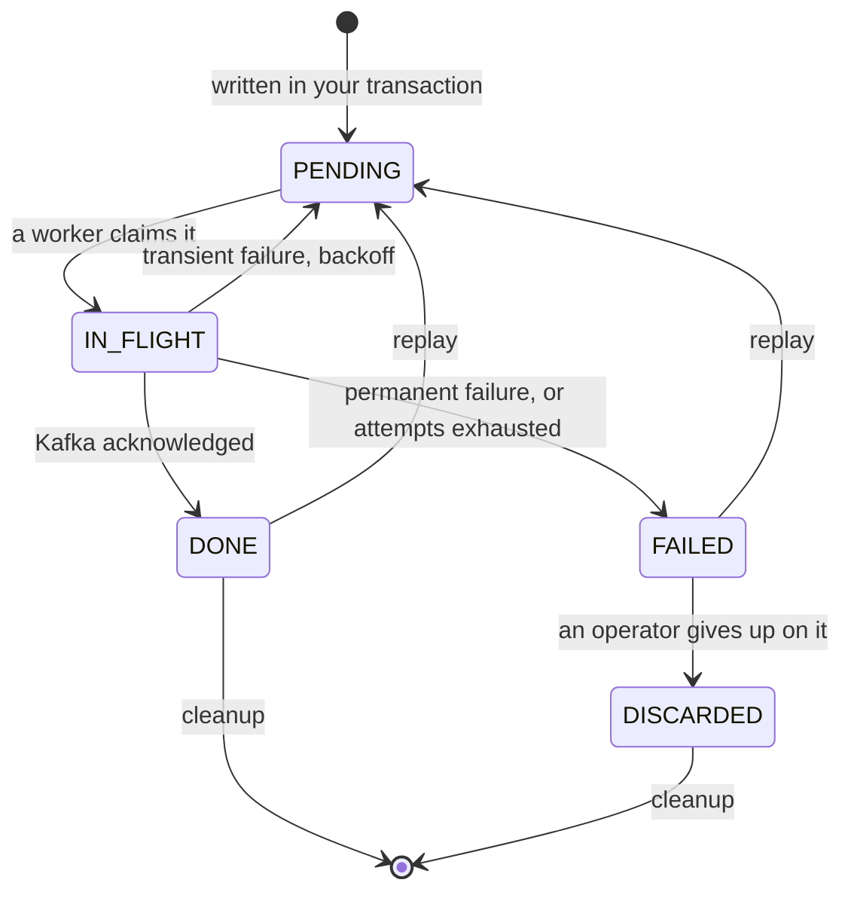

# Reliability and Topology

---

## 0. Who this page is for

You have Tandem running and now you want to know what it does **when things go wrong**, and how to
**arrange it in your deployment**: which process runs the relay, what happens with several
instances, what the bucket count really is, and what Tandem keeps in your database and for how long.

!!! question "The question this page answers"
    **What does Tandem guarantee under failure, how do I shape the deployment around it, and what
    must I never change?**

It builds on [Getting Started](getting-started.md) and assumes Kafka as the destination.

---

## 1. What is guaranteed, in four lines

- **At least once.** An event is marked `DONE` only after Kafka has durably acknowledged it. A relay
  that dies between the acknowledgement and that update publishes the event again on restart: a
  **duplicate**, never a loss.
- **In order, per aggregate.** Events of one aggregate are published in the order they were written.
  Events of different aggregates have no order between them, by design.
- **A failure stops the aggregate, not the relay.** An event that cannot be delivered blocks the
  events behind it **for the same aggregate** and nothing else.
- **Nothing is skipped silently.** Skipping an event is a decision an operator takes explicitly, with
  a reason, through the [Admin API](admin-api.md#33-recovering-messages).

Everything below is how those four lines hold up when Kafka, the database or a relay instance fails.

---

## 2. Failure handling

### 2.1 One delivery, step by step

When the relay claims a row it sends it to Kafka and waits for the acknowledgement. Then one of
three things happens:

| Outcome | What Tandem does |
|---|---|
| Kafka acknowledges | The row becomes `DONE`, and the relay moves to the next event of that aggregate. |
| The send fails in a way that may pass | The row goes back to `PENDING`, scheduled for a later attempt after a **backoff**. Each failure counts as an attempt. |
| The send fails in a way that will never pass, or the attempts run out | The row becomes `FAILED`. Its aggregate is blocked until an operator resolves it. |

The backoff is **exponential with full jitter**: the wait before the next attempt is a random value
between zero and `min(5 minutes, 1 second × 2^attempts)`. The attempt budget is `tandem.relay.max-attempts`,
**10** by default. Both the delay and the number of attempts are counted per row, and a replay gives a
row a fresh budget.

### 2.2 What is retried and what fails at once

Tandem sorts each Kafka error into one of two classes.

| Class | Errors | Result |
|---|---|---|
| **Transient**, retried | Timeouts, not enough replicas, leadership changes and any error Tandem does not recognize. | Backoff and retry, until the attempts run out. |
| **Permanent**, fails at once | Record too large, serialization failure, authorization or authentication failure, an invalid topic, an unsupported protocol version. | The row becomes `FAILED` immediately: retrying a problem that cannot pass only keeps the aggregate blocked for longer. |

A failure to **build the message** (an event that cannot be encoded, or a topic that cannot be chosen)
is treated as permanent too, since encoding the same row again fails the same way.

Every failure is logged with the row id, the aggregate and the topic (see
[Observability](observability.md#24-the-lines-worth-knowing)), and a `FAILED` row shows up in
`tandem.outbox.failed.count`.

### 2.3 Kafka unavailable for a while

The producer has its own retry window, capped by `delivery.timeout.ms` (30 seconds by default), and
Tandem's ladder sits on top of it. With the defaults, ten attempts, each waiting out the producer's
timeout and then a backoff, add up to **on the order of ten minutes**. If Kafka is unreachable for longer than that, rows start to run out of
attempts and become `FAILED`, and their aggregates block even though the cause was not the events at
all.

That is deliberate: a relay that retried forever would hide a real poison message. The right response
is to plan for it:

- **Alert on `failed.count`** (see [Observability](observability.md#33-alerts-worth-having)) so you
  hear about it.
- **After the outage, replay what failed.** One bulk replay resets every `FAILED` row back to
  `PENDING`, and the relay delivers them in their original order:

    ```bash
    tandem-cli outbox replay-bulk --status FAILED --dry-run     # count first
    tandem-cli outbox replay-bulk --status FAILED --yes
    ```

- **If your Kafka maintenance windows are longer than the ladder, raise `max-attempts`.** More
  attempts stretch the ladder; the cost is that a genuine poison message takes longer to surface.

The events written during the outage are not lost in any of this: they sit in the outbox as `PENDING`
and go out as soon as the relay can send.

### 2.4 The database unavailable

Your own transactions fail while the database is down, exactly as they would without Tandem, so no
outbox row is written for a change that did not commit. On the relay side, every housekeeping task
that cannot reach the database logs an `ERROR` and tries again on its next tick, and a worker that
hits an unexpected error is restarted by the relay. When the database is back the relay resumes on its
own, with nothing to reset.

### 2.5 A relay that crashes mid-send

A row being sent is `IN_FLIGHT` under a **row lease** (`tandem.relay.row-lease`, 60 seconds by
default). If the relay dies, the lease expires, the row is reclaimed and goes back to `PENDING`, and
it is sent again. That is where duplicates come from, and it is what `tandem.outbox.lease_expired.count`
counts.

There is one hard rule tying this to Kafka: **the row lease must be longer than the producer's
`delivery.timeout.ms`**. Otherwise a lease could expire while its send is still legitimately in
progress and the row would be delivered twice for no reason. Tandem checks this at startup, refuses to
run if it is violated, and the error tells you the values and a recommended minimum (twice the delivery
timeout). It reads the timeout the producer will actually use, including one Tandem raised itself to
satisfy Kafka's own floor, so a client upgrade cannot silently break it.

### 2.6 Stopping cleanly

A normal shutdown (`relay.stop()` in plain Java, the application shutdown in Spring) stops taking new
work, and under `LEASE` coordination releases the buckets the instance owned so that others take them
over at once. Rows in flight at that moment are recovered by their lease, as in a crash. Either way the
worst outcome is a duplicate.

---

## 3. Deployment topology

Two choices describe a relay deployment, and they are independent.

| Choice | Options |
|---|---|
| **Where the relay runs** | **Embedded** in your application, or **split** into a process of its own. |
| **How instances share the work** | **`SINGLE`**: exactly one relay instance. **`LEASE`**: any number, coordinated through the database. |

Only the write side must run inside your application, because it takes part in your transaction.
Everything else works from the database alone.

| | `SINGLE` | `LEASE` |
|---|---|---|
| **Embedded** | The default: one deployable, one instance hosting the relay. | Your application runs several replicas, each hosting a relay. |
| **Split** | One dedicated relay process. | Several relay processes. |

Guarantees are identical in all four. They are properties of the database, the hashing and the Kafka
settings, not of where the relay runs.

### 3.1 Embedded

The default, and the right one until you have a reason not to. Your application hosts the relay, so it
needs both modules and Kafka on its classpath. This is what
[Getting Started](getting-started.md#6-step-4-start-the-relay) sets up.

### 3.2 Split

Run the relay as its own process when you want your application to stay free of the Kafka client and
its dependency tree, or want the relay to have its own lifecycle and failure domain: a relay restart
or garbage collection pause then never touches request handling.

The two sides share **only the database** and one agreed value, the bucket count (§4). Nothing calls
between them.

=== "Your application (writes)"

    ```kotlin
    dependencies {
        implementation(platform("com.codingful:tandem-bom:x.y.z"))
        implementation("com.codingful:tandem-spring-producer")   // no Kafka client
    }
    ```

    ```yaml
    tandem:
      outbox:
        bucket-count: 256
    ```

=== "The relay (its own application)"

    ```kotlin
    dependencies {
        implementation(platform("com.codingful:tandem-bom:x.y.z"))
        implementation("com.codingful:tandem-spring-relay")
        implementation("com.codingful:tandem-kafka")
        implementation("org.springframework.boot:spring-boot-starter-jdbc")
        runtimeOnly("org.postgresql:postgresql")
    }
    ```

    ```yaml
    spring:
      main:
        web-application-type: none          # nothing to serve
      datasource:
        url: jdbc:postgresql://db:5432/orders
    tandem:
      outbox:
        bucket-count: 256                   # the same value as the write side
      kafka:
        source: /orders/relay
        producer:
          bootstrap.servers: kafka:9092
    ```

The relay is an ordinary Spring Boot application with a `main` and the two Tandem starters. The
schema is applied once, by your own migrations, exactly as for an embedded relay.

**One image, two roles.** If you prefer to build a single application that can play either role, put
both modules in it and choose with a property: `tandem.relay.enabled: false` loads the module without
starting a relay.

The database schema is the one contract the two sides share. They may run different Tandem versions
for a while, as long as both work against the schema in place (see
[Testing and Upgrades](testing-and-upgrades.md#2-upgrades)).

### 3.3 `SINGLE` and `LEASE`

`SINGLE` is the default and costs nothing: the one instance owns every bucket in memory, and there is
no coordination table to maintain.

`LEASE` is for **more than one relay instance**. Buckets are owned one instance at a time under a
renewable lease stored in the database. If an instance dies its leases expire (30 seconds by default,
`tandem.relay.bucket-lease`) and the survivors take its buckets over, so coverage heals itself. Each
instance also registers itself, so when a new instance starts, the others release a fair share to it.

=== "Spring Boot"

    ```yaml
    tandem:
      relay:
        coordination: LEASE
        instance-id: orders-relay-1        # optional, see below
    ```

=== "Plain Java"

    ```java
    RelayConfig cfg = RelayConfig.builder()
        .bucketCount(256)
        .coordination(Coordination.LEASE)
        .instanceId("orders-relay-1")
        .build();

    BucketSource buckets = BucketSource.forCoordination(cfg, dataSource);
    RelayControlSource control =
        new JdbcRelayControlSource(dataSource, cfg.coordination(), cfg.reclaimInterval());

    WorkerPool relay = new WorkerPool(store, kafka, cfg, TandemMetrics.NOOP, Clock.systemUTC(),
        BackoffStrategy.fullJitter(), buckets, control);
    ```

The **instance id** identifies one running instance and must be **unique** among concurrent ones, at
most 64 characters. Left unset, Tandem derives one from the host, the process and a random suffix.
Set it yourself when you want a stable name in logs, the metrics and the Admin API across restarts,
for example the pod or host name.

Two facts make `LEASE` safe to turn on:

- **One instance under `LEASE` works.** It simply owns every bucket, so enabling it "to be safe" is
  cheap. The default stays `SINGLE` because most deployments never need the extra table traffic.
- **A brief overlap is harmless.** While buckets move between instances, two of them may for a moment
  both consider a bucket theirs. Row-level claiming means the worst case is a duplicate, never a
  reordering.

!!! warning "More than one relay without `LEASE` is a misconfiguration"
    Ordering and single-claim still hold, because they are enforced on the row and not by bucket
    ownership, so it does not corrupt anything. But every instance polls every bucket, which is wasted
    work, and worse, **each instance keeps its own view of what it published**. One aggregate's history
    is split across them, and the detector that reports out-of-order publishing (see
    [Observability](observability.md#33-alerts-worth-having)) goes largely blind, with nothing to tell
    you. If more than one relay runs, use `LEASE`.

The mode is **declared, not detected**, because an instance cannot know whether it is one of several
without the very table `LEASE` provides. The relay records the mode it runs in, so the
[Admin API](admin-api.md#16-two-coordination-modes) knows which per-bucket operations apply.

---

## 4. The bucket count

### 4.1 What it is

Tandem spreads aggregates over a fixed number of **virtual buckets**, `bucket-count`, 256 by default.
When a row is written, its bucket is computed from the aggregate id (a hash of it, modulo the bucket
count) and stored on the row. Every event of one aggregate therefore lands in the same bucket, a
bucket is owned by one worker at a time, and that is what makes the aggregate's events go out in order
with no per-aggregate lock. The hash is computed in Java and is stable across databases and versions,
so an aggregate never changes bucket.

### 4.2 The rules

- **The write side and the relay must use the same value.**
- **It must never change after the first event is written**, because it is baked into every stored
  row. The valid range is 1 to 32,767.
- **The default is right for most deployments.** Leave it unset unless you have a reason.

### 4.3 The startup guard

If the write side used 256 and the relay 512, new rows would land in buckets no worker owns. Nothing
would fail: events would pile up as `PENDING` and delivery would silently stop. Tandem closes that gap
with a check at startup:

- On the **first** start, the value is recorded in the database (the `tandem_meta` table).
- On every later start, on either side, a **different** value is refused, with a message that names
  both values and says which is which.

Spring runs the check for you on both sides. In plain Java, call it once per process at startup,
against the plain `DataSource` and not inside a transaction:

```java
BucketCountGuard.check(dataSource, bucketCount);
```

The guard reads what the first process to start wrote, so it also protects a new environment: whatever
value is configured first becomes the reference.

### 4.4 Changing it

There is **no supported way to change the bucket count** once events exist. Doing it would mean moving
every stored row to a new bucket and coordinating the switch across every writer and relay at once,
which a startup check cannot do safely. The guard's job is to detect a mismatch, never to accept it.
Treat the value as part of your data's identity, choose it before the first deployment, and keep it.

---

## 5. What Tandem keeps in your database

### 5.1 The tables

Tandem writes only its own `tandem_*` tables and never touches a table of yours.

| Table | When | What it holds |
|---|---|---|
| `tandem_outbox` | Always | The events and their delivery state. |
| `tandem_meta` | Always | A few named settings and states: the bucket count, whether the relay is paused, the coordination mode, and the relay's heartbeat. |
| `tandem_bucket_lease` | `LEASE` | Which instance owns which bucket, and until when. |
| `tandem_relay_member` | `LEASE` | Which instances are alive, so the split rebalances when one joins. |

The schema you apply creates all four whether or not you use `LEASE`. The two lease tables simply stay
unused under `SINGLE`.

### 5.2 The life of a row



A row is never edited apart from its delivery state. The payload, the headers, the sequence number and
the aggregate stay exactly as your application wrote them, which is what makes replay safe.

Two details worth knowing when you read a row after a replay: its `lastError` is **kept**, so you still
see why it failed, and its `replays` counter records how many times an operator replayed it.

### 5.3 Cleanup and retention

The relay periodically deletes finished rows so the table does not grow forever. It removes rows that
are `DONE` or `DISCARDED` and older than the **retention** period. `FAILED` rows are **never** deleted:
they are waiting for a person.

| Property | Default | Meaning |
|---|---|---|
| `tandem.relay.retention` | 14 days | How long finished rows are kept. Judged on when the row was **created**. |
| `tandem.relay.cleanup-interval` | 15 minutes | How often the cleanup runs. |
| `tandem.relay.cleanup-batch-size` | 1000 | Rows deleted per pass. |

Retention is how far back you can **replay and audit**: a `DONE` row that has been cleaned up can no
longer be replayed. Choose it by how long you want that safety net to reach, not by table size. Under
`LEASE` the cleanup runs on every instance and steps over rows another instance is already deleting, so
running several is safe.
